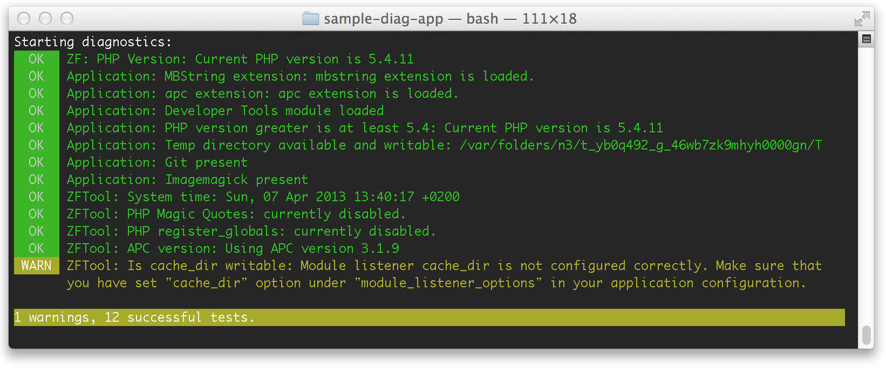
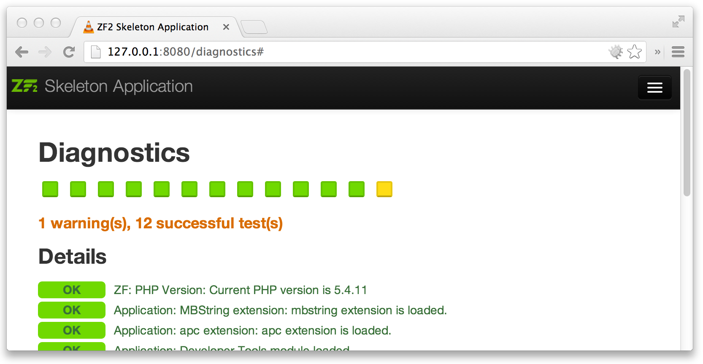

  ZF2 Tool Diagnostics
==========================

1. [Running diagnostics in console](#running-diagnostics-in-console)
2. [Running diagnostics in web browser](#running-diagnostics-in-web-browser)
3. [What is a test?](#what-is-a-test)
4. [Adding tests to your module](#adding-tests-to-your-module)
5. [Tests in config files](#tests-in-config-files)
6. [Using built-in diagnostics tests](#using-built-in-diagnostics-tests)
7. [Providing debug information in tests](#providing-debug-information-in-tests)


## Running diagnostics in console

After installing ZF2 tool, you can run application diagnostics with the following console command:

    php public/index.php diag

This will run the default set of diag tests and in case of trouble, display any errors or warnings.


To display additional information on the tests performed, you can run diagnostics in verbose mode using
`--verbose` or `-v` switches:

    php public/index.php diag -v



Some tests will also produce debug information, which you can display with `--debug` switch:

    # Run diagnostics in "debug" mode
    php public/index.php diag --debug

You could also specify which tests you want to run (which module to test):

    # Run only tests included in Application module
    php public/index.php diag Application


## Running diagnostics in web browser

In order to enable diagnostics in browser, copy the included `config/zftool.global.php.dist` file to
your `config/autoload/` directory and rename it to `zftool.global.php`. Now open the file and uncomment
the `router => array()` section. The default URL for diagnostics is simply:

    http://yourwebsite/diagnostics

You can always change it to anything you like by editing the above config file.




## What is a test?

A test is simply:

 * Any function (anonymous, named, method), or
 * Any class implementing `ZFTool\Diagnostics\Test\TestInterface`

A test returns:

  * `true` which means test passed OK,
  * `false` which means test failed,
  * a `string` with warning message,
  * or instance of `ZFTool\Diagnostics\Result`, including Success, Failure, Warning.


## Adding tests to your module

The simplest way to add tests is to write `getDiagnostics()` method in your module main class. For example, we could
add the following tests to our `modules/Application/Module.php` file:

````php
<?php
namespace Application;

class Module {
    // [...]

    /**
     * This method should return an array of tests,
     */
    public function getDiagnostics()
    {
        return array(
            'Memcache present' => function(){
                return function_exists('memcache_add');
            },
            'Cache directory exists' => function() {
                return file_exists('data/cache') && is_dir('data/cache');
            }
        );
    }
}
````

The returned array should contain pairs of a `label => test`. The label can be any string and will only be
used as a description of the tested requirement. The `test` can be a callable, a function or a string, which
will automatically be expanded. The following chapter describes all available methods of declaring tests.


## Tests in config files


The second method is to define tests in config files which will be lazy-loaded as needed. Diagnostic
component can understand the following types of definitions:

### Test function name

The simplest form of a test is a "callable", a function or a method. Here are a few examples:

````php
<?php
// modules/Application/config/module.config.php
return array(
    'diagnostics' => array(

        // "application" test group
        'application' => array(
            // invoke static method Application\Module::checkEnvironment()
            'Check environment' => array('Application\Module', 'checkEnvironment'),

            // invoke php built-in function with a parameter
            'Check if public dir exists' => array('file_exists', 'public/'),

            // invoke a static method with 2 parameters
            'Check paths' => array(
                array('Application\Module', 'checkPaths'),
                'foo/',
                'bar/'
            )
        )
    )
);
````

### Test class name

Assuming we have written following test class:

````php
<?php
namespace Application\Test;

class is64bit extends ZFTool\Diagnostics\Test\AbstractTest
{
    public function run()
    {
        return PHP_INT_SIZE === 8;
    }
}
````

We can now use it in our Application configuration file in the following way:

````php
<?php
// modules/Application/config/module.config.php
return array(
    'diagnostics' => array(
        'application' => array(
            'Verify that this system is 64bit' => 'Application\Test\is64bit'
        )
    )
);
````

It is also possible to provide constructor parameters for test instances, like so:

````php
<?php
// modules/Application/config/module.config.php
return array(
    'diagnostics' => array(
        'application' => array(
            // equivalent of constructing new EnvironmentTest("production", 15);
            'Verify environment' => array(
                'Application\Test\EnvironmentTest',
                'production',
                15
            )
        )
    )
);
````

### Test instance fetched from Service Manager

If we define the test as a string, the diag component will attempt to fetch the test from
Application Service Manager. For example, we could have the following test class:

````php
<?php
namespace Application\Test;

use Zend\ServiceManager\ServiceLocatorAwareInterface;
use Zend\ServiceManager\ServiceLocatorInterface;
use ZFTool\Diagnostics\Test\AbstractTest;

class CheckUserModule extends AbstractTest implements ServiceLocatorAwareInterface
{
    protected $sl;

    public function run()
    {
        return $this->getServiceLocator()->has('zfcuser');
    }

    public function setServiceLocator(ServiceLocatorInterface $sl)
    {
        $this->sl = $sl;
    }

    public function getServiceLocator()
    {
        return $this->sl;
    }
}
````

Now we just have to add proper definition to Service Manager and then diagnostics.


````php
<?php
// modules/Application/config/module.config.php
return array(
    service_manager' => array(
        invokables' => array(
            'CheckUserModuleTest' => 'Application\test\CheckUserModule',
        ),
    ),

    'diagnostics' => array(
        'application' => array(
            'Check if user module is loaded' => 'CheckUserModuleTest'
        )
    )
);
````


## Using built-in diagnostics tests

ZFTool provides several test classes that can easily be called from within config files. These tests reside within
the `ZFTool\Diagnostics\Test` namespace. The following built-in tests are currently available:

### ClassExists

Check if a class (or an array of classes) exist. For example:

````php
<?php
// modules/Application/config/module.config.php
return array(
    'diagnostics' => array(
        'application' => array(
            'Check Lua class' => array('ClassExists', 'Lua'),
            'Check main RBAC classes' => array(
                'ClassExists',
                array('ZfcRbac\Module', 'ZfcRbac\Controller\Plugin\IsGranted')
            )
        )
    )
);
````

### CpuPerformance

Benchmark CPU performance and return failure if it is below the given ratio. The baseline for performance calculation
is the speed of Amazon EC2 Micro Instance (Q1 2013). You can specify the expected performance for the test, where a
ratio of `1.0` (one) means at least the speed of EC2 Micro Instance. A ratio of `2` would mean "at least double the
performance of EC2 Micro Instance" and a fraction of `0.5` means "at least half the performance of Micro Instance".

The following test definition will test if current server has at least half the CPU power of EC2 Micro Instance:

````php
<?php
// modules/Application/config/module.config.php
return array(
    'diagnostics' => array(
        'application' => array(
            'Check minimum CPU performance' => array('CpuPerformance', 0.5),
        )
    )
);
````

### DirReadable

Check if a given path points to a directory and it is readable.

````php
<?php
// modules/Application/config/module.config.php
return array(
    'diagnostics' => array(
        'application' => array(
            'Check public img dir'  => array('DirReadable', 'public/img'),
            'Check system paths' => array(
                'DirRedable',
                array('/tmp', '/usr/tmp', '/bin', '/usr/bin')
            )
        )
    )
);
````

### DirWritable

Check if a given path points to a directory and if it can be written to.

````php
<?php
// modules/Application/config/module.config.php
return array(
    'diagnostics' => array(
        'application' => array(
            'Check if data dir is writable'  => array('DirWritable', 'data'),
            'Check if public dir is writable' => array(
                'DirWritable',
                array('public', 'public/img', 'public/js')
            )
        )
    )
);
````

### ExtensionLoaded

Check if a PHP extension (or an array of extensions) is currently loaded.For example:

````php
<?php
// modules/Application/config/module.config.php
return array(
    'diagnostics' => array(
        'application' => array(
            'Check if mbstring is loaded'  => array('ExtensionLoaded', 'mbstring'),
            'Check if compression extensions are loaded' => array(
                'ExtensionLoaded',
                array('rar', 'bzip2', 'zip')
            )
        )
    )
);
````


### PhpVersion

Check if current PHP version matches the given requirement. The test accepts 2 parameters - baseline version and
optional [comparison operator](http://www.php.net/manual/en/function.version-compare.php).


````php
<?php
// modules/Application/config/module.config.php
return array(
    'diagnostics' => array(
        'application' => array(
            'Require PHP 5.4.5 or newer' => array('PhpVersion', '5.4.5'),
            'Reject beta PHP versions'   => array('PhpVersion', '5.5.0', '<'),
        )
    )
);
````

### StreamWrapperExists

Check if a given stream wrapper (or an array of names) is available. For example:

````php
<?php
// modules/Application/config/module.config.php
return array(
    'diagnostics' => array(
        'application' => array(
            'Check OGG stream' => array('StreamWrapperExists', 'ogg'),
            'Check compression streams' => array(
                'StreamWrapperExists',
                array('zlib', 'bzip2', 'zip')
            )
        )
    )
);
````


## Providing debug information in tests

A test function or class can return an instance of `Success`, `Failure` or `Warning` providing detailed information
on the test performed and its result:

````php
     $success = new ZFTool\Diagnostics\Result\Success( $message, $debugData )
     $failure = new ZFTool\Diagnostics\Result\Failure( $message, $debugData )
     $warning = new ZFTool\Diagnostics\Result\Warning( $message, $debugData )
````

Below is an example of a module-defined tests that return various responses:

````php
<?php
// modules/Application/Module.php

namespace Application;

use ZFTool\Diagnostics\Result\Success;
use ZFTool\Diagnostics\Result\Failure;
use ZFTool\Diagnostics\Result\Warning;

class Module {
    // [...]

    public function getDiagnostics()
    {
        return array(
            'Check PHP extensions' => function(){
                if (!extension_loaded('mbstring')) {
                    return new Failure(
                        'MB string is required for this module to work',
                        get_loaded_extensions()
                    );
                }

                if (!extension_loaded('apc')) {
                    return new Warning(
                        'APC extension is not loaded. It is highly recommended for performance.',
                        get_loaded_extensions()
                    );
                }

                return new Success('Everything in order...');
            }
        );
    }
}
````

